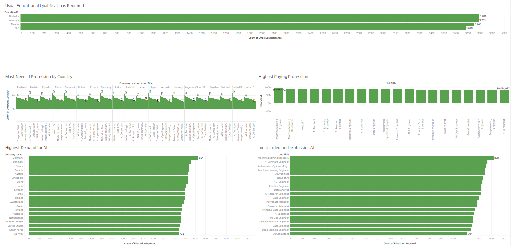

# AI Job Market Demand Analysis (Tableau)

A Tableau workbook exploring how AI is shaping the job market — highlighting in-demand roles, compensation, education requirements, and geographic demand.

## 📊 Overview
This workbook analyzes job market data to identify which professions are most affected by AI demand, which pay the most, and what qualifications they require.

## Key Worksheets
- **Highest Demand for AI** – roles with greatest AI-driven demand
- **Most in Demand Profession (AI)** – top AI-related professions
- **Highest Paying Profession** – compensation comparison across roles
- **Most Needed Profession by Country** – geographic breakdown of demand
- **Usual Educational Qualifications Required** – education levels needed per role

